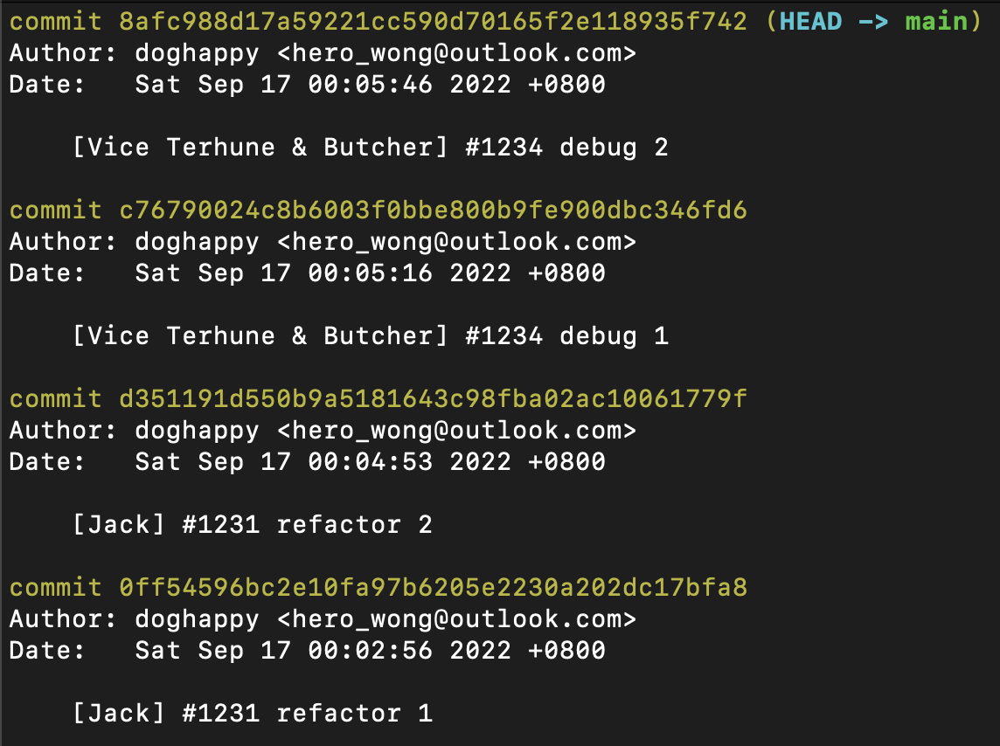
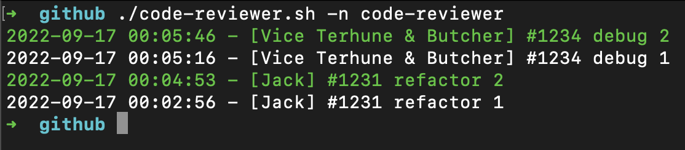

# code-reviewer

为 team 提供的 code review 小工具。

team 的 commit 格式是这样的：

```
[Vice Terhune & Butcher] #1234 debug 2
[Vice Terhune & Butcher] #1234 debug 1
[Jack] #1231 refactor 2
[Jack] #1231 refactor 1
```

此工具会显示最近一天的所有 commit 信息，因为一张卡可能会有多个 commit 记录，此工具会 highlight 出最新一条 commit 的卡号，这样就可以快速的分析出需要 review 的卡。




## 部署方法

把 code-reviewer.sh 放到 repo 的上层目录，如果 sh 文件没有执行权限，请输入 `chmod +x code-reviewer.sh`

## 使用方法

```bash
./code-reviewer.sh -n YOUR-REPO
```
